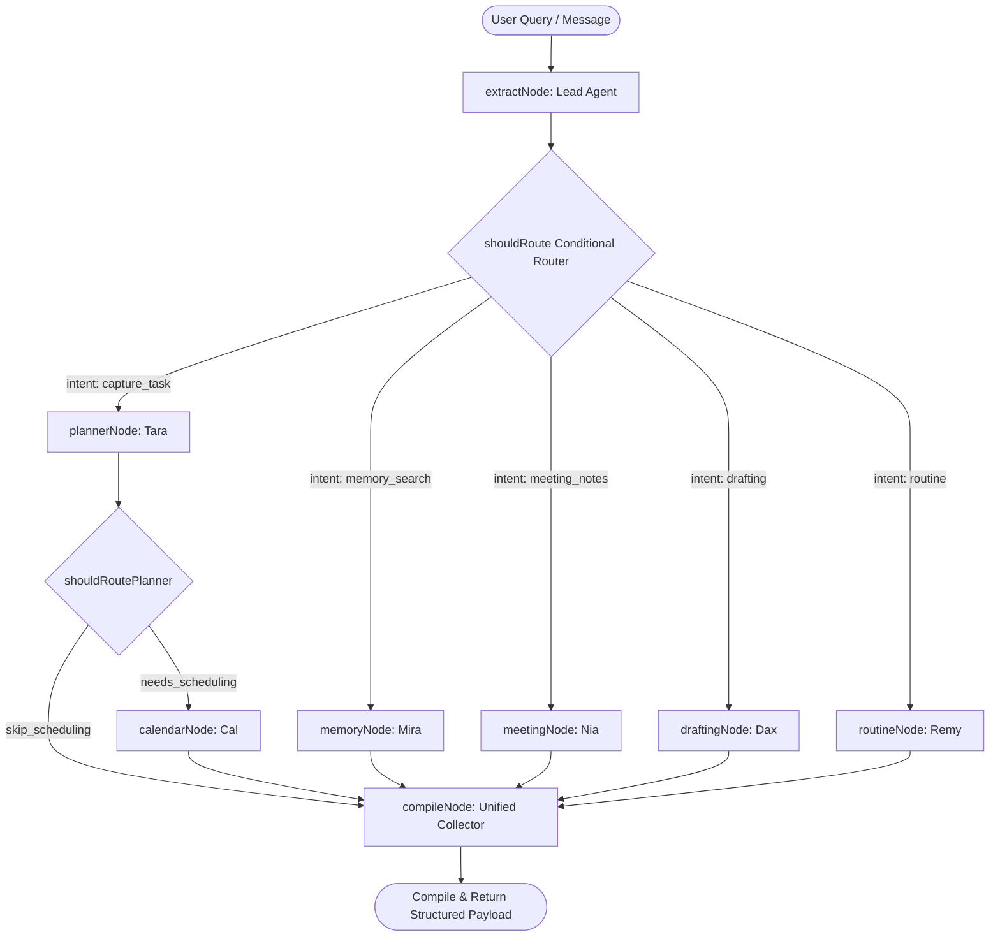

# 🌟 LingT: The Google-Powered Autonomous Agentic Workspace 🚀

Welcome to **LingT**, a production-grade AI productivity workspace built entirely on the **Google Cloud, Firebase, and Gemini Developer Ecosystem**. LingT shifts the paradigm from passive, easily-ignored alerts to **active, autonomous agentic execution** by using Google's state-of-the-art AI, database, and API platforms to handle the friction of planning, drafting, and scheduling.

---

## 🛡️ Showcasing the Google Developer Stack

LingT is a showcases of how different **Google Products** coordinate seamlessly to build a secure, real-time, agentic workflow:

| Google Product 🤖 | Role in LingT 🌟 | Tech Stack Depth 🛠️ |
| :--- | :--- | :--- |
| **Google AI Studio & Gemini** | **Core Brain & Reasoning**: Powers all intent parsing, task extraction, meeting capture, and drafting workflows using structured `gemini-1.5-flash` schemas. | LLM Cognition |
| **Google Agentic Development Kit (ADK)** | **Multi-Agent Team Framework**: Organizes, builds, and instantiates our specialist agents (`planner_agent`, `calendar_agent`, `memory_agent`, etc.) at runtime. | Agentic Framework |
| **Google Firebase Auth** | **Secure Google Sign-In**: Authenticates users and generates secure verification tokens for backend requests. | Identity & Auth |
| **Google Cloud Firestore** | **Real-Time Database Sync**: Keeps the dashboard, tasks, habits, and message logs synchronized across client and server instantly. | Real-Time NoSQL DB |
| **Google Calendar API** | **Live Protected Schedules**: Queries active timetables, checks conflicts, and commits protected AI time blocks. | Workspace Integration |
| **Google Gmail API** | **Autonomous Inbox Scanner**: Scans unread emails in the background to automatically capture tasks and loops. | Workspace Integration |
| **Google Chrome Web Speech API** | **Voice-Enabled Dictation**: Native client-side Speech-to-Text for chat messages and meeting capture. | Voice & Accessibility |
| **Google Cloud Run (GCP)** | **Containerized Serverless Deployment**: Securely hosts and scales containerized microservices in a zero-trust environment. | Serverless Hosting |
| **GCP Service Accounts & IAM** | **Zero-Trust Security**: Secures Server-to-Server interactions and Firestore document permissions without exposing keys to the client. | Cloud Security |

---

## 🚨 Traditional Gaps in Productivity Tools vs. LingT's Google Solutions

Standard productivity apps fail because they place 100% of the cognitive load on the user. Here is how LingT leverages Google Tech to solve them:

* ❌ **Passive Triggers** ➔ 🌟 **GCP-Driven Escalation**: Remy (Reminders Agent) dynamically upgrades alerts (Gentle ➔ Urgent ➔ Repeated ➔ Alarm) using Firebase Cloud Messaging and auto-saves records to Firestore.
* ❌ **Manual Input Fatigue** ➔ 🌟 **Google API Autopilot**: Gmail scan endpoints query unread emails, runs Gemini analysis to extract commitments, and populates your workspace.
* ❌ **Disconnected Contexts** ➔ 🌟 **Google LangGraph Coordination**: Specialized agents share a centralized LangGraph state, allowing you to ask Gemini to protective-schedule blocks for tasks.
* ❌ **No Memory Context** ➔ 🌟 **Firestore-Backed Context Window**: Injects your profile name, recent chat logs, and active database lists directly into Gemini's system prompt on every turn.
* ❌ **Purely Text-Based** ➔ 🌟 **Chrome Web Speech Dictation**: Client-side Speech-to-Text allows dictating notes or chats natively with one click.

---

## 🌐 Dynamic Multi-Agent LangGraph Architecture

Instead of a single linear LLM call, LingT operates a **branching conditional state machine** built on **LangChain & LangGraph**. When a user interacts with the system, the query enters a structured routing sequence:



### 👥 The Specialist Agent Team (Google ADK)

Our team consists of specialized agents instantiated via the **Google Agentic Development Kit (ADK)**:

| Specialist Agent 🤖 | Code Name 🏷️ | Core Instruction 📜 | Approval Policy 🔒 |
| :--- | :--- | :--- | :--- |
| **Lead Orchestrator** | `ling_lead` | Coordinates the Specialists, manages user communication, and parses intents. | No external writes. |
| **Task Planner** | `planner_agent` | Prioritizes tasks and maps realistic timeline slots. | Auto-saves task cards. |
| **Calendar Guard** | `calendar_agent` | Proposes time blocks to protect study/work hours. | Requires user approval before writing. |
| **Memory Specialist** | `memory_agent` | Queries semantic logs across all historical inputs and records. | Read-only database access. |
| **Meeting Capture** | `meeting_agent` | Extracts summaries, decisions, and action items from transcripts. | Auto-saves item drafts. |
| **Drafting Studio** | `drafting_agent` | Prepares follow-up templates and emails. | Requires user approval before exporting. |
| **Routine Inspector** | `routine_agent` | Evaluates deadline risks and manages active check-ins. | Auto-saves routine execution traces. |

---

## 🛠️ Deep-Dive: LangGraph State Machine Routing & Logic

To achieve true multi-agent autonomy, we implement a highly structured routing schema utilizing **LangGraph** (the LangChain state machine library). This design avoids linear script chains and allows the orchestrator to dynamically route threads between agents.

### 1. State Definition (Centralized Agent Memory)
The entire conversation lifecycle is tracked within a centralized State object. This state acts as the shared memory of the execution graph. As the payload moves from node to node, each agent reads from and writes to the following state fields:
* **User Message**: The raw query entered by the user in the chat interface.
* **Chat History**: An array of recent user and AI message turns retrieved dynamically from Firestore, structured as LangChain message models.
* **Workspace Context**: A compiled markdown string of the user's active database documents (including active tasks, open loops, habit streaks, and routines).
* **Extraction Payload**: The structured JSON data returned by Gemini after parsing intent.
* **Model Source**: Tracks whether the reasoning was completed by Gemini or the local fallback handler.
* **Execution Trace (Graph)**: A history tracker that appends the name of every node visited in sequence (e.g., extract Node, route Node, planner Node).
* **Agent Actions**: A compiled list containing active specialist agent roles and descriptions to display in the frontend sidebar.

---

### 2. Conditional Edges (Dynamic Decision Routing)
Rather than executing every agent's logic on every turn, LangGraph utilizes conditional routing edges.
* **Initial Intent Dispatcher**: After the Lead Agent parses the initial request, the router evaluates the extracted intent category (such as task planning, memory search, or draft generation) and dispatches execution directly to the corresponding specialist branch.
* **Cascading Nodes**: Branches can cascade. For instance, when the Task Planner node completes, the graph router checks if scheduling time blocks are recommended. If so, it dynamically cascades control to the Calendar node before forwarding to compilation, otherwise it bypasses calendar logic entirely to save performance.

---

### 3. State Graph Compilation
The compilation binds nodes and conditional routes into a unified, secure state graph execution plan.
* **Node Registration**: Each specialist agent (Planner, Calendar, Memory, etc.) is registered as a discrete processing node.
* **Edge Connections**: Define static connections (from the Start token to the extraction node) and conditional routes to map branching pathways.
* **Unified Collector (Compile Node)**: Serves as the final destination for all branches. It aggregates the graph trace, compiles approval flags (like calendar commits or email drafts that require double-user authorization), and formats the final payload sent back to the Next.js client.

This design ensures only the required specialist agents are invoked, providing high-speed responses and clean logs.

---

## 🧠 Firestore-Backed Context Window & Memory
To avoid generic, disconnected interactions, the orchestrator injects the **complete user workspace state** directly into Gemini's context window. On every interaction:
1. **User Identity**: Loads the authenticated profile name from **Firebase Auth** (e.g., `Shrujal Ganatra`).
2. **Chat History**: Retrieves the last 10 messages from the **Firestore** `messages` collection, ordered by timestamp, and maps them to LangChain `AIMessage` and `HumanMessage` nodes.
3. **Workspace State**: Queries active Tasks, Open Loops, Habits, and Routines from **Firestore** in parallel.
4. **Context Injection**: Formats this data into a structured Markdown string and attaches it to the System Prompt, giving **Gemini** a live snapshot of your life database.

---

## 🎙️ Google Web Speech API Dictation
To satisfy the voice-enabled assistance requirement, LingT utilizes browser-native **Web Speech API** (`webkitSpeechRecognition`).
* Users can dictate thoughts directly into the Chat bar or the Meeting Capture text area.
* Captures continuous audio stream client-side, transcribes it on-the-fly, and appends it to the inputs.
* Uses the Google Chrome/Edge native speech recognition engine—ensuring high-accuracy transcription with zero latency or server-side cost.

---

## 📅 Live Google Calendar Sync
* Custom OAuth callback exchange writes Google Auth tokens directly to Firestore.
* Real-time `/api/calendar/list` endpoint queries upcoming events from the **Google Calendar API**.
* When a user clicks **Approve and Commit** on an AI proposed calendar block, the backend creates the calendar event. The UI instantly refetches and displays it in the "Calendar Plan" list.

---

## 🔌 API Endpoint Specifications

| Endpoint 🔗 | Method 🛠️ | Description 📝 | Auth Required 🔑 |
| :--- | :---: | :--- | :---: |
| `/api/orchestrate` | `POST` | Dispatches query, history, and workspace context to the LangGraph state machine. | Optional (Guest Fallback) |
| `/api/calendar/list` | `POST` | Fetches the user's actual scheduled events from the Google Calendar API. | **Yes** (Bearer Token) |
| `/api/calendar/commit` | `POST` | Creates a new committed calendar block event on the Google Calendar. | **Yes** (Bearer Token) |
| `/api/gmail/sync` | `GET`/`POST` | Fetches unread emails, runs Gemini analysis, and extracts tasks to Firestore. | **Yes** (Bearer Token) |
| `/api/chat/save` | `POST` | Saves message documents (user and assistant turns) to Firestore. | **Yes** (Bearer Token) |
| `/api/integrations/google/webhook` | `POST` | Receives Google Pub/Sub push webhooks for instant, real-time unread email syncing. | No (Secured by Google Pub/Sub credentials checks) |

---

## 🚀 Local Setup Instructions

Follow these steps to run the application locally on your workstation:

### Prerequisites

- [Node.js](https://nodejs.org/) (v18.x, v20.x, or newer recommended)
- [npm](https://www.npmjs.com/)

### Installation

1. Install dependencies:
   ```bash
   npm install
   ```

2. Copy the example variables file to create a local environment file:
   ```bash
   cp .env.example .env.local
   ```
3. Open `.env.local` and add your custom secret keys:
   - Provide a valid **Gemini API Key** (`GEMINI_API_KEY`).
   - Insert **Firebase API credentials** for persistent user data.
   - Set **Google Calendar OAuth** Client ID & Client Secret.

### Run Development Server

Launch the development server:
```bash
npm run dev
```

Open [http://localhost:3000](http://localhost:3000) inside your web browser to interact with the dashboard.
